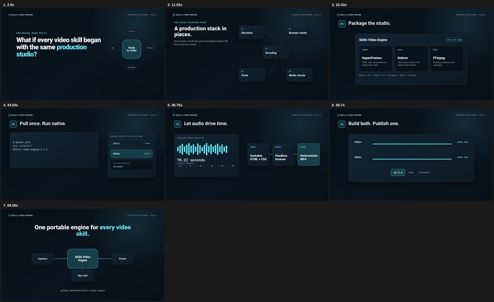
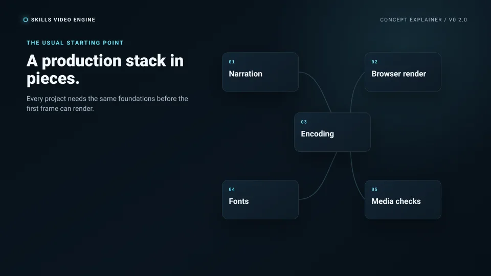
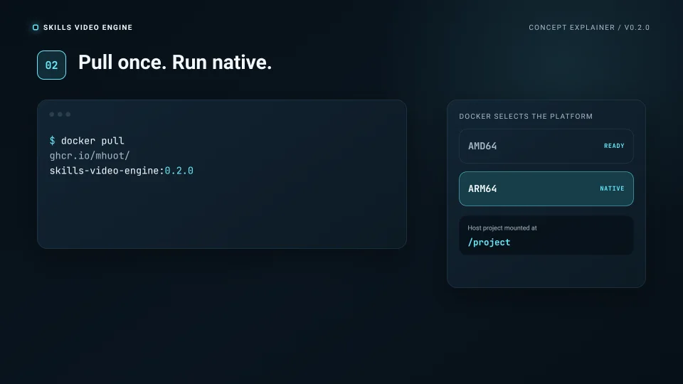
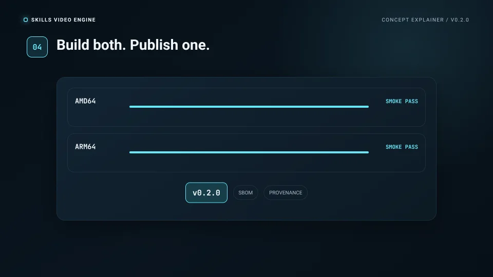

# Skills Video Engine

One portable production studio for agent video skills. This public OCI image
packages the shared generation toolchain used by
[explainer-video](https://github.com/mhuot/explainer-video-skill) and
promo-video:

- HyperFrames for deterministic HTML/CSS/JavaScript video rendering
- Kokoro-82M for local narration
- FFmpeg and FFprobe for encoding and media QA
- Python 3.12, Node.js 22, Chromium, and chrome-headless-shell

After the image is pulled, generation can run without network access. Project
files remain on the host and are mounted into `/project`.

## See the engine in action

<p align="center">
  <a href="docs/assets/showcase/skills-video-engine-explainer.mp4?raw=1">
    
  </a>
</p>

<p align="center">
  <strong><a href="docs/assets/showcase/skills-video-engine-explainer.mp4?raw=1">Watch or download the 75-second explainer (MP4)</a></strong>
</p>

The engine puts narration, browser rendering, encoding, fonts, and media checks
in one versioned environment. Pull once, mount a project, and invoke each
production tool directly.

| One production toolchain | Native multi-architecture image | Verified publishing |
| --- | --- | --- |
|  |  |  |
| The same foundations for every video skill. | Linux AMD64 and ARM64, with native selection on Apple Silicon. | Smoke-tested images published with SBOM and provenance attestations. |

Explainer production files and methodology are available in the
[skills-video-engine-explainer source repository](https://github.com/mhuot/skills-video-engine-explainer).

## Pull

```bash
docker pull ghcr.io/mhuot/skills-video-engine:latest
```

For repeatable production, use a version tag or image digest instead of
`latest`.

## Use

Mount an explainer-video project and invoke the underlying tools directly:

```bash
docker run --rm \
  --user "$(id -u):$(id -g)" \
  -v "$PWD:/project" \
  ghcr.io/mhuot/skills-video-engine:latest \
  python tools/tts_generate.py
```

```bash
docker run --rm \
  --user "$(id -u):$(id -g)" \
  -v "$PWD:/project" \
  ghcr.io/mhuot/skills-video-engine:latest \
  hyperframes render video --output production/renders/master.mp4
```

```bash
docker run --rm \
  --user "$(id -u):$(id -g)" \
  -v "$PWD:/project" \
  ghcr.io/mhuot/skills-video-engine:latest \
  ffprobe -v error -show_format -show_streams \
  production/renders/master.mp4
```

On SELinux hosts, append `:Z` to the volume mount. The `--user` option keeps
generated files owned by the current host user.

### Windows / WSL2 (ARM) usage

Recommended: run from WSL2 (Ubuntu) for best compatibility with POSIX paths,
UID mapping, and bash scripts. Keep your explainer-video project inside the
WSL filesystem (e.g. `~/explainer-video-skill`) to avoid Windows/WSL path and
permission issues.

From WSL2:

```bash
cd ~/explainer-video-skill
docker pull ghcr.io/mhuot/skills-video-engine:latest
# TTS generation (preserves file ownership)
docker run --rm -v "$PWD:/project" --user "$(id -u):$(id -g)" ghcr.io/mhuot/skills-video-engine:latest python tools/tts_generate.py
# Render video (preserves file ownership)
docker run --rm -v "$PWD:/project" --user "$(id -u):$(id -g)" ghcr.io/mhuot/skills-video-engine:latest hyperframes render video --output production/renders/master.mp4
```

From PowerShell (less ideal):

```powershell
cd $env:USERPROFILE\explainer-video-skill
docker pull ghcr.io/mhuot/skills-video-engine:latest
# Files created by the container may be owned by root; chown from WSL or re-run without --user and fix ownership
docker run --rm -v "${PWD}:/project" ghcr.io/mhuot/skills-video-engine:latest hyperframes --version
```

Notes / troubleshooting:

- Run `bash scripts/smoke_test.sh` inside a Linux environment (WSL/Git Bash) to reproduce CI checks.
- If you see permission issues, run `chown` from WSL or re-run container without
  `--user` and fix ownership afterwards.
- Ensure Docker Desktop is configured with enough CPU and RAM for headless
  Chromium and model operations.

## Build locally

```bash
docker build -t skills-video-engine:local .
bash scripts/smoke_test.sh skills-video-engine:local
```

The build downloads and caches the pinned Kokoro model revision. It also
includes the corresponding Debian source packages for FFmpeg and x264 under
`/usr/src/third-party`.

## Releases

Git tags matching `v*` publish these GHCR tags:

- Full semantic version, such as `0.1.0`
- Major/minor version, such as `0.1`
- Git SHA
- `latest`

Published images include an SBOM and build-provenance attestations.

## License

Project source is MIT licensed. Container components retain their own licenses;
see [THIRD_PARTY_NOTICES.md](THIRD_PARTY_NOTICES.md).
